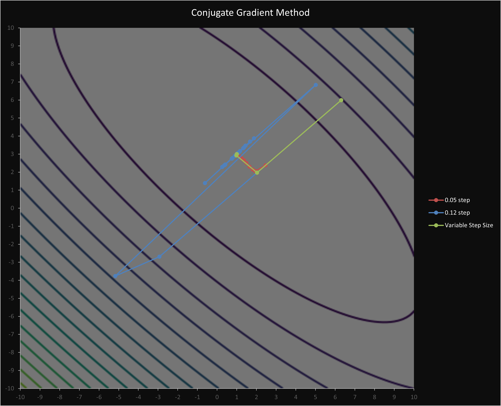

# Overview
This repository contains a large-scale C++ project developed as part of the **Optimization** course during the fifth semester at **AGH University of Krakow**. The project is a collaborative group assignment, where we worked in groups of three. The goal was to implement various optimization methods within a given framework.

---



# Authors

- **[Arek](https://github.com/arekan144)**: Implementation of optimization algorithms, test exercises for algorithm validation, and the contributions to spreadsheet for results.
- **[Filip](https://github.com/Filip-Rak)**: Implementation of the real-world problem exercises, focusing on practical applications of optimization methods, as well as contributions to the spreadsheet for results and graphs.
- **[Paulina](https://github.com/paulina-grab-owska)**: Responsible for compiling the lengthy coursework report, documenting the optimization process, methodology, and results of the project in detail.

This project was a collaborative effort, with each team member contributing their unique expertise to ensure that the solution was both comprehensive and effective.

---

# Optimization Methods

- **Expansion Method** - A technique used to expand and explore regions in optimization problems, typically used in iterative algorithms to find optimal solutions.

- **Hooke-Jeeves Method**: A direct search optimization method, also known as the **pattern search method**, used to find optimal solutions without requiring derivatives.

- **Rosenbrock Method**: Known as **Rosenbrock's valley**, this method is used in optimization problems where the objective function has a narrow, curved valley. It's commonly used for testing optimization algorithms.

- **Nelder-Mead Simplex Method** - Also known as the **simplex method**, is a popular approach for finding the minimum of a function in a multidimensional space. It is a heuristic method that doesn’t require derivatives.

- **Steepest Descent Method** - An optimization technique where the search proceeds in the direction of the steepest negative gradient, aiming to find the local minimum of a function.

- **Conjugate Gradient Method** - An iterative optimization technique used to solve large linear systems and optimization problems, particularly when the objective function is quadratic.

- **Newton's Method** - A root-finding algorithm that uses the derivative of a function to iteratively find better approximations of its roots, often used for optimization in multivariable functions.

- **Powell's Method** - A conjugate direction method for multidimensional optimization that doesn’t require derivatives and is effective for functions that are not smooth or continuous.

- **Evolutionary Algorithm – (μ+λ) Strategy** - A form of evolutionary computation where a population of candidate solutions is evolved over generations using selection, recombination, and mutation to find an optimal solution.

---

# Framework 

The framework for this project was provided by our teacher **dr. inż. Łukasz Sztangret**, who also guided us throughout the development process. The framework is designed to facilitate the implementation and testing of various optimization methods. Below is an overview of its key components:

1. **Matrix Class**
- Represents a comprehensive matrix implementation with overloaded operators, friend functions, and various utility methods for ease of use.
- Simplifies matrix operations such as addition, multiplication, and inversion, which are often required in optimization algorithms.

2. **Solution Class**
- Represents the result of an optimization process.
- Stores important data about the solution, including:
    - The optimized values of x (input variables) and y (objective function value).
    - The number of function calls made during optimization.

3. **solve_ode File**
- Implements the 4th-order Runge-Kutta method for solving ordinary differential equations (ODEs).

4. **opt_alg File**
- Contains all optimization methods implemented in the project.

5. **user_funs File**
- Contains user-defined functions related to the exercises, including both test functions and real-world problem functions

6. **Main File**
- Implements the logic for calculating solutions for each lab exercise

The framework is organized into separate `.cpp` and `.h` files for each component

---

# Repository Structure

```
root/
├── Coursework-Reports/      # Contains the results for each lab assignment
│   ├── 1st-assignment/      # Spreadsheet and report for the 1st assignment
│   ├── 2nd-assignment/      # Spreadsheet and report for the 2nd assignment
│   ├── 3rd-assignment/      # Spreadsheet and report for the 3rd assignment
│   ├── 4th-assignment/      # Spreadsheet and report for the 4th assignment
│   ├── 5th-assignment/      # Spreadsheet and report for the 5th assignment
│   └── 6th-assignment/      # Spreadsheet and report for the 6th assignment
│
├── Optimization/            # Optimization project framework and related files
│   ├── Input/               # Input files for each assignment
│   ├── Output/              # Output files for each assignment
|
├── Media/                   # Various media for README.md file
|
└── README.md                # This file
```

---

# Installation

1. Open **Visual Studio** and click **"Clone a repository"**.
2. Paste the project's URL as the location: https://github.com/Filip-Rak/Optimization

---
